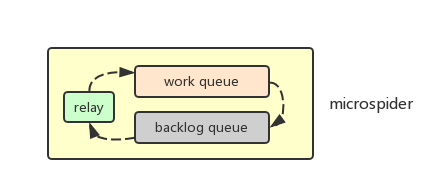
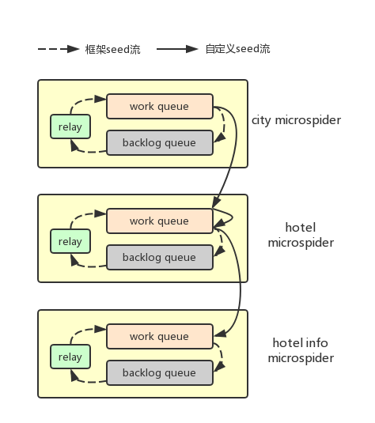

# microspider

微爬虫, 顾名思义，该爬虫框架将一个完整网站的爬取抽象成多个微爬虫，每个爬虫只
处理一种场景，即一种url类型结果的处理，多个爬虫之间通过消息队列进行协调。

一个好的爬虫框架应该具有以下特点：

1. 请求自动重试, 可以设定重试次数；

2. 支持代理设置, 最好能支持http和https；

3. 经过重试过后，没有成功的请求，存放到队列中，可以下次重试；

4. 解析出错后，自动记录出错的文本信息, 以供下一步调试；

5. 支持多实例部署，提供抓取效率;

6. 提供命令行清除上次运行过程中的cache；

7. 可以对上次跑失败的请求进行快速重试；

8. 在一次任务执行结束后，可以对失败的请求再次重试，并设置max_age，超过一定
重试次数后，便不再尝试；

9. 用户只用关注如何解析，以及解析的顺序，无需关注处理细节；

10. 提供便捷的方法或指导，将数据以及cache迁移到另一台机器上；

11. 不用处理异常，用户只需要知道有哪些url没有处理成功，通过重试或者查看失败的原因就能解决问题；

`microspider`按照以上几点设计要求进行设计，它依赖于以下包：

* gevent
* requests
* beautifulsoup4
* json
* redis
* pymongo

它使用gevent+requests组合来高效的发起url请求，使用beautifulsoup4进行html文件的解析, 使用json来
解析json数据，使用redis作为任务执行的消息队列, 使用mongo来存储解析失败的Response数据以便进行
后续的调试。

## 设计架构

每个microspider实例包含3个组件：work消息队列、backlog消息队列和relay线程，每个实例使用一个进程运行。

实例运行时，首先会从work消息队列中获取seed，根据seed发起网络请求，自动处理重试、cache已成功的请求
以及将失败的seed发送到backlog消息队列中；

用户只需关注实例的parse函数，它会被传入requests的Response对象，用户使用beautifulsoup4
来解析html，使用json来解析json格式数据。用户在parse函数无需处理解析过程中的异常，框架自动捕捉
解析异常，向backlog消息队列发送失败的seed，并将异常的文件保存到mongodb中，供用户调试分析。

用户在parse函数中，可以处理额外的cache逻辑, 如寻找最大页，或者生成新的seed，将seed发送对当前
work消息队列，或另一个爬虫实例的work消息队列中。

relay线程负责将backlog消息队列中的seed发送到work消息队列中，为什么使用2个消息队列，是基于以下考虑：

1. 有时候请求失败后，不能立即重试，需要过短时间重试才能解决，直接将失败的seed发送到work消息队列，
实际不能解决问题；

2. 可以灵活地实现需要的重试机制。如果需要立即重试，可以自动开启relay线程，实时将backlog消息队列的seed
移动到work消息队列；也可以在work消息队列空后，再将backlog消息队列中的seed移动到work消息队列。或者什么
都不干。

seed会包含重试次数，当seed达到最大重试次数时，relay线程将不会将这些seed移动到work消息队列。

seed会包含以下属性：

* url: 请求的url地址
* method: 请求的方法，GET或者POST
* headers: dict类型，请求头
* cookies: dict类型，cookies
* query: dict类型，请求参数
* meta: dict类型，其它与请求有关的参数，与应用有关

### 应用案例

以抓取携程网酒店开业时间和装修时间为例，要抓取酒店开业时间和装修时间，需要经过以下步骤：

1. 抓取城市列表；

2. 根据城市url抓取酒店列表，并需要翻页；

3. 根据酒店url请求酒店信息页面，提取出开业时间和装修时间

携程网酒店数量大概在30万左右，存在反爬机制，会导致页面请求出错，或者返回错误信息导致无法正常解析,
抓取需要保证数据的完整性。携程网爬虫使用microspider设计如下：

可以看到爬虫共有3个microspider组成，包括city、hotel和hotel info。city microspider抓取城市列表，
从work队列中获取酒店大全的url，然后解析页面，存储城市url等相关信息，将城市的url包装成seed发送到
hotel microspider的work队列；

hotel microspider从work队列中获取seed, 一方面解析页面，将得到的酒店页面的url包装成seed，
发送到hotel info microspider的work队列，另一方面根据自定义逻辑翻页，生成
新的seed发送到当前工作队列; 

hotel info microspider从work队列获取seed，请求并解析页面，存储提取出的信息。

图中虚线箭头表示microspider框架自动的seed数据流，处理数据异常的重试。实线是用户根据实际需要，
构造的seed流。

## 设计说明

microspider提供丰富的命令行工具，以满足不同需求：

`microspider <command> [options] [args]`

可用的命令行包括：

* gen
    生成一个microspider模版文件

* run
    运行一个microspider实例

* clear
    请求实例抓取过程中的cache

* relay
    手动将backlog消息队列中seed移动到work消息队列

* parse
    将mongodb存储的解析失败的Response内容重新解析

* dump
    查看work和backlog消息队列中的seed

* migrate
    环境迁移，用于将cache、消息队列和mongodb存储的数据，迁移到新的环境中

### run

`microspider run [options] <spider>`

|短选项|长选项|默认值|说明|样例|
|---|---|---|---|---|
|-|--redis|127.0.0.1:6379|redis访问地址|
|-o|--work-queue|0|用作work消息队列的redis的db|
|-b|--backlog-queue|0|用作backlog消息队列的redis的db, 默认与work队列使用相同db|
|-c|--cache-db|0|用作cache的redis的db, 默认与work队列使用相同db|
|-r|--retry|3|每次请求重试次数
|-|--no-cache|false|默认会将请求成功的seed缓存，下次使用时，会自动跳过该seed请求
|-w|--worker|1|进程数，开多少个爬虫实例
|-p|--http-proxy|-|是否使用http代理
|-m|--max-age|5|最大重试次数，超个这个次数，relay线程不会移动失败的seed
|-d|--relay-mode|0|relay线程工作模式，0表示实时，1表示work消息队列空后，2表示什么也不做
|-|--mongo-uri|mongodb://127.0.0.1:3306|用于存储解析失败的Response内容
|-|--mongo-db|microspiders|用于存储解析失败的Response内容
|-|--pool|100|使用多少个协程来运行
|-|--no-backlog|-|失败的seed不会发送到backlog消息队列，此时backlog消息队列没有用
|-|--config|microspider.cfg|配置文件，从该文件中读取配置

### parse

`microspider parse [options] <spider>`

|短选项|长选项|默认值|说明|样例|
|---|---|---|---|---|
|-|--mongo-uri|mongodb://127.0.0.1:3306|解析失败的Response内容存放mongodb地址|
|-|--mongo-db|microspiders|用于存储解析失败的Response内容|
|-|--no-cache|false|如果解析成功，默认会将seed进行缓存|
|-n|--num|-|如果设定，将只解析n个失败的内容

### relay

`microspider relay [options] <spider>`

将backlog消息队列中的seed移动到work消息队列

|短选项|长选项|默认值|说明|样例|
|---|---|---|---|---|
|-o|--work-queue|0|用作work消息队列的redis的db|
|-b|--backlog-queue|0|用作backlog消息队列的redis的db, 默认与work队列使用相同db|
|-m|--max-age|5|最大重试次数，超个这个次数，relay线程不会移动失败的seed
|-r|--clear|-|使用这个选项后，将置seed的age属性为0

### clear

`microspider clear [options] <spider>`

清除缓存或存储在mongodb中失败的解析内容或消息队列

|短选项|长选项|默认值|说明|样例|
|---|---|---|---|---|
|-c|--cache|-|清除请求的cache
|-m|--mongo|-|清除存储在mongo里解析失败的内容
|-o|--work-queue|0|清除work消息队列|
|-b|--backlog-queue|0|清除backlog消息队列|

### dump

`microspider dump [options] <spider>`

转储work或backlog消息队列中的seed

|短选项|长选项|默认值|说明|样例|
|---|---|---|---|---|
|-o|--work-queue|0|转储work消息队列|
|-b|--backlog-queue|0|转储backlog消息队列|
|-f|--field|'url'|可指定多个该选项，输出时使用空格分开

### migrate

`microspider migrate [options] <spider>`

将本地环境dump下来，用于迁移到新的环境

|短选项|长选项|默认值|说明|样例|
|---|---|---|---|---|
|-m|--mode|output|迁移模式，input或者output
